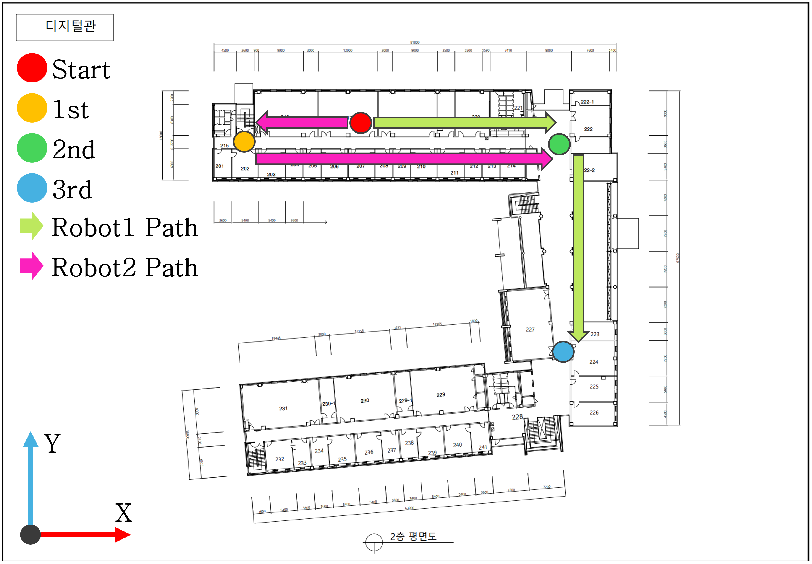

# TRLIID
## Twin Robot LiDAR Inertial Indoor Dataset

## 1. Introduction
**TRILIID** is a twin robot LiDAR inertial indoor dataset which is collected in Digital building, Kumoh national institute of technology. It consists of sequences of two different paths that contain dynamic objects.
Data was collected by attaching 'RPLIDAR A3' and 'IntelliThings IAHRS' sensors to Turtlebot 2e.
This dataset was collected by Multi Agent System Laboratory(MASL).

### 1.1 Hardware setting

    

### 1.2 Floor plan with robot paths

    

### 1.3 Real environments

    

### 1.4 Point-by-point coordinates(m)
* **Robot1 starting point** : 0, 0
* **Robot2 starting point** : 0, -0.61
* **1st point** : -23.675(±0.219), -4.305(±0.066)
* **2nd point** : 39.825(±0.313), -4.455(±0.071)
* **3rd point** : 39.825(±0.313), -47.355(±0.306)

[The values in parentheses next to the measurements indicate the error range.]

## IMU Intrinsics
Will be added soon.

### Robot1.

### Robot2.

## 3. Downloads
link: Will be added soon.

## 4. Paper
Will be added soon.

## Acknowledgement
This research was supported by Korea Institute of Marine Science & Technology Promotion(KIMST) funded by the Ministry of Trade, Industry and Energy in 2023 (Project Number 20210630)
